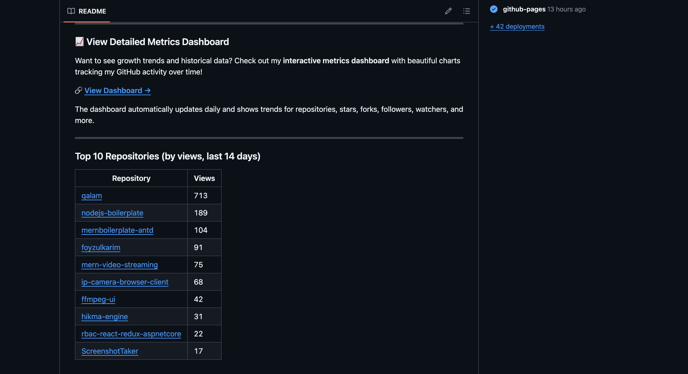
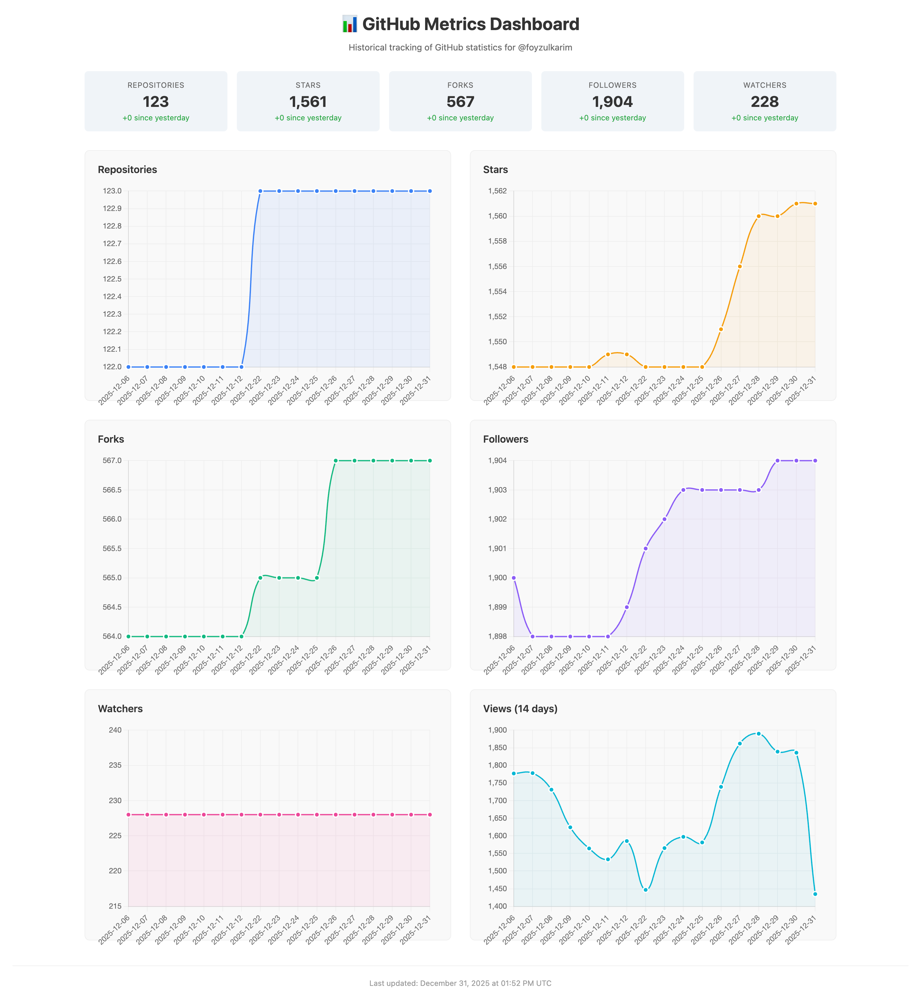

# GitHub Profile Metrics

Automated GitHub metrics tracking with a beautiful dashboard.

## Why Use This?

Ever wanted to track your GitHub journey over time? Whether you're building your developer portfolio, showcasing your growth to employers, or just curious about how your projects are performing, this template makes it incredibly easy to visualize your GitHub statistics.

Unlike static stats badges that only show current numbers, this template provides:
- **Historical trends** - See how your stars, followers, and views grow over time
- **Interactive charts** - Beautiful, responsive visualizations powered by Chart.js
- **Zero maintenance** - Once set up, it updates automatically every day
- **No coding required** - Just use this template, add one secret, and you're done

It works for any GitHub user regardless of account size - from hobbyist with a few repos to open-source maintainer with hundreds.

## Dashboard Preview





## Quick Setup

1. **Use this template** → Click the green "Use this template" button above
2. **Name your repository** → Must be `<your-username>/<your-username>` for profile README, or any name for standalone metrics
3. **Create a Personal Access Token:**
   - Go to [GitHub Settings → Developer Settings → Personal Access Tokens → Tokens (classic)](https://github.com/settings/tokens)
   - Click "Generate new token (classic)"
   - Give it a name like "Metrics Token"
   - Select scopes: `repo` (full), `read:user`
   - Generate and copy the token
4. **Add the secret:**
   - Go to your new repository → Settings → Secrets and variables → Actions
   - Click "New repository secret"
   - Name: `METRICS_TOKEN`
   - Value: paste your token
5. **Enable GitHub Pages:**
   - Go to Settings → Pages
   - Source: "Deploy from a branch"
   - Branch: `main`, folder: `/docs`
   - Save
6. **Run the workflow:**
   - Go to Actions → "Update GitHub Metrics"
   - Click "Run workflow"
   - Wait ~2 minutes for completion

Your dashboard will be live at: `https://<your-username>.github.io/<repo-name>/`

---

## My GitHub Stats

| Metric | Count |
|--------|-------|
| Repositories | <!--TOTAL_REPOS-->0<!--/TOTAL_REPOS--> |
| Stars | <!--TOTAL_STARS-->0<!--/TOTAL_STARS--> |
| Forks | <!--TOTAL_FORKS-->0<!--/TOTAL_FORKS--> |
| Watchers | <!--TOTAL_WATCHERS-->0<!--/TOTAL_WATCHERS--> |
| Followers | <!--TOTAL_FOLLOWERS-->0<!--/TOTAL_FOLLOWERS--> |
| Views (14 days) | <!--TOTAL_VIEWS-->0<!--/TOTAL_VIEWS--> |

<sub>Last updated: <!--LAST_UPDATED-->2026-01-17 00:18 UTC<!--/LAST_UPDATED--></sub>

---

### Top Repositories (by views, last 14 days)

<!--TOP_REPOS_START-->
| Repository | Views |
|------------|-------|

<!--TOP_REPOS_END-->

---

## Features

- 📊 **Interactive Dashboard** - Beautiful Chart.js visualizations
- 🔄 **Daily Updates** - Automatic metrics collection via GitHub Actions
- 📈 **Historical Tracking** - 365 days of rolling data
- 📱 **Responsive Design** - Works on desktop and mobile
- 🔒 **Private Data Safe** - Only collects public metrics
- ⚡ **Zero Maintenance** - Set it and forget it

## How It Works

1. GitHub Actions runs daily at midnight UTC
2. Collects metrics via GitHub's GraphQL and REST APIs
3. Updates this README with latest numbers
4. Appends data to `metrics-history.json`
5. Dashboard reads JSON and renders charts

## Customization

### Change Update Frequency

Edit `.github/workflows/update-metrics.yml`:

```yaml
on:
  schedule:
    - cron: "0 */6 * * *"  # Every 6 hours instead of daily
```

### Modify Dashboard Colors

Edit `docs/index.html` and change the `colors` object:

```javascript
const colors = {
    repos: '#3b82f6',     // Blue
    stars: '#f59e0b',     // Amber
    forks: '#10b981',     // Green
    followers: '#8b5cf6', // Purple
    watchers: '#ec4899',  // Pink
    views: '#06b6d4'      // Cyan
};
```

## Token Permissions Explained

| Scope | Why Needed |
|-------|------------|
| `repo` | Access traffic data (views) for your repositories |
| `read:user` | Read your profile information (followers) |

## Troubleshooting

**Workflow fails with 401 error:**
- Your `METRICS_TOKEN` secret may be expired or invalid
- Generate a new token and update the secret

**Dashboard shows "No data":**
- Wait for the first workflow run to complete
- Check Actions tab for any errors

**Views always show 0:**
- Traffic data requires `repo` scope on your token
- Traffic data is only available for repos you own

## Credits

Built with:
- [GitHub Actions](https://github.com/features/actions)
- [Chart.js](https://www.chartjs.org/)
- [GitHub GraphQL API](https://docs.github.com/graphql)

## License

MIT License - feel free to use and modify!
